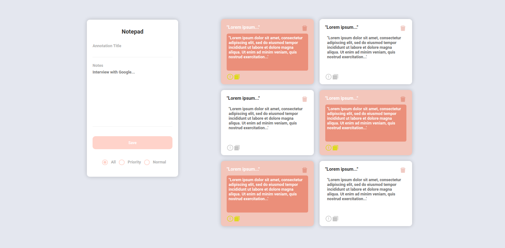
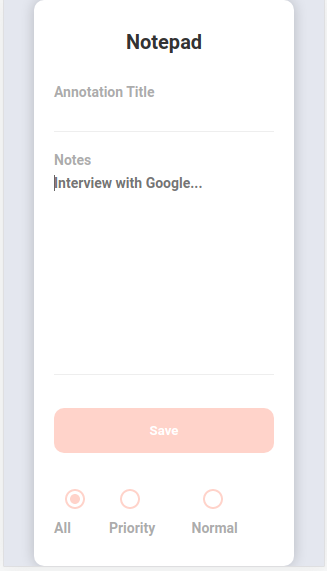
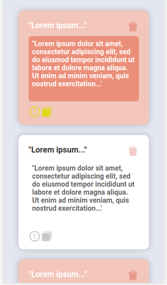

## To-Do-List
To do list se trata de uma lista de tarefas de coisas que precisam ser feitas onde o usuário pode criar, editar e deletar uma tarefa realizando assim o famoso CRUD.

Projeto Completo Com Node.JS e  React.JS  Utilizando a famosa Stack MERN: 
`*MongoDB + Express + React JS + Node JS*`

 <h1 align="center">Tela Principal - Desktop</h1>

 

  
 

 <h1 align="center">Tela Principal - Mobile</h1>

 

  
 

 <h1 align="center">Tela Principal - Mobile Conteúdo</h1>

 

  
 

 ### Functionalities

+ Create notes in the database (Criar registros no banco de dados)
+ Read notes in the database (Ler registros do banco de dados)
+ Update notes in the database (Atualizar registros do banco de dados)
+ Delete notes in the database (Excluir registros do banco de dados)
+ Option to select view all cards, view priority card only, or view normal card only (Opção de selecionar ver todos os cards, ver apenas card com prioridade ou ver apenas card normal) 
+ Option to prioritize card urgently (Opção para priorizar cartão com urgência)

## MongoDB Configuration database

1. Acesse o site oficial do MongoDb e se cadastre

2. Selecione a opção FREE e clik em `Criar Cluster`

3. Clike em `*Connect*` dentro do modal que ir'abrir clik em `*Allow Acess from Anywhre*` ou seja permitir acesso de qualquer lugar (como se trata de um projeto de estudo não precisa colocar essa configuração para que o acesso seja de um único endereço de IP)

4. Preencha os dados em `Create a Database User` (ainda no modal) que são eles: `username` e `password` após isso clik `Create Database User`

5. Vc já deve estar num novo modal se seguiu os passos corretamente, click em `Choose a connection method` e após em `Connect your aplication` repare se o node está selecionado e o deixe selecionado. NOTA: Nesse mesmo modal vc tem um código de acesso semelhante a este:

`*mongodb+srv://usuario:<password>@cluster0.xkef2.mongodb.net/myFirstDatabase?retryWrites=true&w=majority*`

é essa sua conexão com o mongodb onde irá substituir o nome usuario pelo usuario q vc criou e a senha é a senha q vc criou & myFirstDataBase é o banco q vc irá criar no item `6` abaixo

6. Vá em `*Browser Collections*` e vamos criar uma collections que é semelhante a uma tabela do banco de dados SQL, clik em `*Add my own data*` irá abrir um modal para vc colocar um `Database Name` e `Collection Name`, aqui eu dei ambos os nomes para `annotations` e com isso clik em `create`

7. Fui em `Browser collection` e em `annotations` e clikei em `insert document` e no modal inseri dados parecidos com que pretendo mandar ao db, fiz isso para teste, para que eu pudesse buscar essa informações e lê-las para validação do read e do db obviamente, esse teste aconte no `AnnotationController.js`

## Installation Insominia
A instalação é bem simples, só entrar no site e fazer o dowload
Insomnia é uma ferramenta cliente de API REST para utilizar os métodos HTTP: GET, POST, PUT, DELETE entre outros

## Commands used in the backend
(é obrigatório o NodeJS E NPM está instalado na máquina.)

1. `npm init -y` 
(esse comando cria o package.json)

2. `npm install express` 
(Framework que ajuda nas aplicações backend, facilitando o request e o response.)

3. `npm install nodemon -D`
(-D siginifica dependeçia a ser instalada apenas para desenvovlimento e o nodemon serve para ouvir nossas alterações sem a necessidade de ficar resetando o servidor manualmente, essa dependeçia não precisa ir para produção pq o servidor lá não fica ouvindo alterações.)

4. Antes de instalar o nodemon usava o comando: `node index.js` para rodar o servidor, agora após a instalação do `nodemon` se usa `npm run dev`
PQ aconteceu isso? pq fui em package.json e adicionei nos scripts a seguinte linha: 
`"dev": "nodemon src/index.js",`

5. `npm install mongoose`
(mongoose facilita a criação de esquemas para o database mongoodb e facilita para criar registros, buscar registro e etc...)

6. `npm install cors` -> responsável por fazer a comunicação entre o fronend e o backend
Vá no index e adicone o cors com: `const cors = require('cors');`
e depois use-o com: `app.use(cors());`
Obs: deve ficar antes do: "app.use(express.json());"  e do "app.use(routes);"

### Installation FrontEnd

1. `npx create-react-app frontend` (Para criação do projeto e seus múdulos, dẽ o comando na raíz da pasta.)

2. `npm satart` (para rodar o projeto)

3. `npm install axios` (Cliente Http, em termos básicos serve para facilitar a comunicação do back com o front, está sendo configurado na pasta `services` e usado onde estiver havendo uma requisição)

4. `npm install @material-ui/core` (Lib para ajuda na estilização mas aqui só foi usada para os button do type radio)

5. `npm install react-icons --save` (para habilitar ícones do próprio react) 
   `https://react-icons.github.io/react-icons` 

